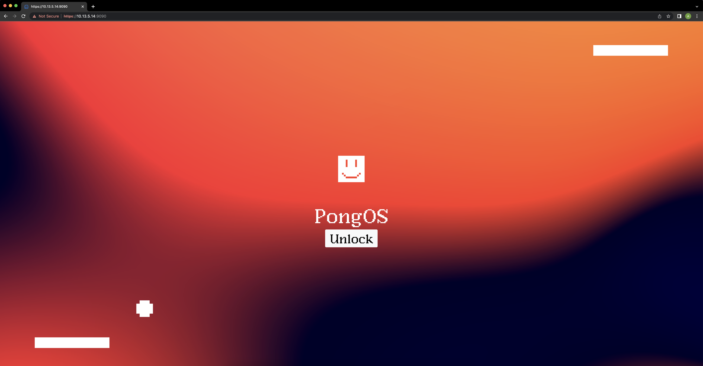

# FT_Transcendence - 42 Network School Capstone Project

Welcome to the FT_Transcendence repository! This project is a capstone project for 42 Network School, showcasing the development skills of its contributors. The main technologies used in this project include Docker, Django, Vanilla JavaScript, and Nginx.

## Brief Overview

FT_Transcendence is an online Pong game that utilizes the Docker platform for containerization, Django for the backend, and Vanilla JavaScript for the frontend. Nginx is employed as both a static HTML server and a reverse proxy for the Django API, ensuring efficient handling of frontend and backend requests.

## Tools Used

- **Docker:** Used for containerization, enabling seamless deployment across different environments.
- **Django:** A high-level Python web framework that facilitates rapid development and clean, pragmatic design.
- **Vanilla JavaScript:** Employed for the frontend development, providing a lightweight and efficient user interface.
- **Nginx:** Serves static HTML pages and acts as a reverse proxy for the Django API.
- **Bootstrap:** A front-end framework for building responsive and visually appealing web pages.


## Preview

### Login Page


### Online Pong Game Demonstration
[Watch the Video](Backend/srcs/mediafiles/mediafiles/movie.png) *(Add a link to the video demonstrating the online Pong game and 2FA)*

## Getting Started

To get started with FT_Transcendence, follow these steps:

### Clone the repository

```bash
git clone https://github.com/jya0/ft_transcendence.git

cd ft_transcendence

docker-compose up --build
```

## Access the application at http://localhost:9090.

